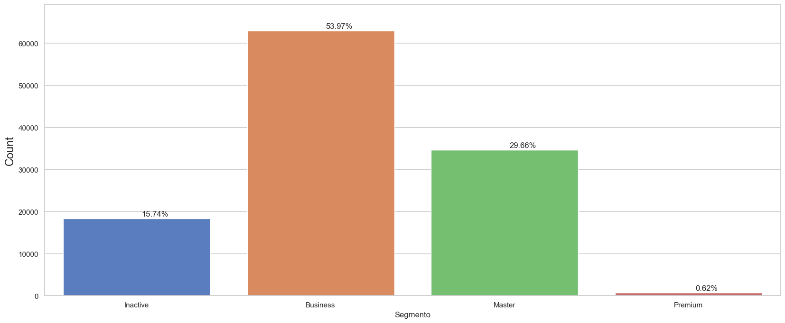

# Data clustering: customer segmentation

An e-commerce store.
We connect buyers and sellers.
E-commerce stores have the problem of sending a large volume of emails about their products, but with little acceptance or interest from customers. A lot of investment in marketing and little effectiveness. This project aims to use a method that can create groups of customers, to send emails by segments, finding customers of greater interest.
To do this, this project uses clustering.


```python
import pandas as pd
import numpy as np
import matplotlib.pyplot as plt
import seaborn as sns
import datetime
```


```python
df = pd.read_csv('ClientDatabase.csv')
```


```python
df.info()
```

    <class 'pandas.core.frame.DataFrame'>
    RangeIndex: 116581 entries, 0 to 116580
    Data columns (total 27 columns):
     #   Column                Non-Null Count   Dtype  
    ---  ------                --------------   -----  
     0   amostra               116581 non-null  int64  
     1   id_cliente            116581 non-null  object 
     2   id_unico_cliente      116581 non-null  object 
     3   item_id               116581 non-null  int64  
     4   cep_cliente           116581 non-null  int64  
     5   cidade_cliente        116581 non-null  object 
     6   estado_cliente        116581 non-null  object 
     7   id_pedido             116581 non-null  object 
     8   status_pedido         116581 non-null  object 
     9   horario_pedido        116581 non-null  object 
     10  pedido_aprovado       116567 non-null  object 
     11  pedido_entregador     115368 non-null  object 
     12  pedido_entregue       114066 non-null  object 
     13  data_estimada         116581 non-null  object 
     14  id_vendedor           116581 non-null  object 
     15  preco                 116581 non-null  float64
     16  frete                 116581 non-null  float64
     17  pagamento_sequencial  116581 non-null  int64  
     18  pagamento_tipo        116581 non-null  object 
     19  pagamento_prestacoes  116581 non-null  int64  
     20  pagamento_valor       116581 non-null  float64
     21  review                116581 non-null  int64  
     22  categoria             116581 non-null  object 
     23  categoria_ingles      116581 non-null  object 
     24  cep_vendedor          116581 non-null  int64  
     25  cidade_vendedor       116581 non-null  object 
     26  estado_vendedor       116581 non-null  object 
    dtypes: float64(3), int64(7), object(17)
    memory usage: 24.0+ MB
    


```python
df.head()
```


<div>
<table border="1" class="dataframe">
  <thead>
    <tr style="text-align: right;">
      <th></th>
      <th>amostra</th>
      <th>id_cliente</th>
      <th>id_unico_cliente</th>
      <th>item_id</th>
      <th>cep_cliente</th>
      <th>cidade_cliente</th>
      <th>estado_cliente</th>
      <th>id_pedido</th>
      <th>status_pedido</th>
      <th>horario_pedido</th>
      <th>...</th>
      <th>pagamento_sequencial</th>
      <th>pagamento_tipo</th>
      <th>pagamento_prestacoes</th>
      <th>pagamento_valor</th>
      <th>review</th>
      <th>categoria</th>
      <th>categoria_ingles</th>
      <th>cep_vendedor</th>
      <th>cidade_vendedor</th>
      <th>estado_vendedor</th>
    </tr>
  </thead>
  <tbody>
    <tr>
      <th>0</th>
      <td>0</td>
      <td>06b8999e2fba1a1fbc88172c00ba8bc7</td>
      <td>861eff4711a542e4b93843c6dd7febb0</td>
      <td>1</td>
      <td>14409</td>
      <td>franca</td>
      <td>SP</td>
      <td>00e7ee1b050b8499577073aeb2a297a1</td>
      <td>delivered</td>
      <td>2017-05-16 15:05:35</td>
      <td>...</td>
      <td>1</td>
      <td>credit_card</td>
      <td>2</td>
      <td>146.87</td>
      <td>4</td>
      <td>moveis_escritorio</td>
      <td>office_furniture</td>
      <td>8577</td>
      <td>itaquaquecetuba</td>
      <td>SP</td>
    </tr>
    <tr>
      <th>1</th>
      <td>1</td>
      <td>8912fc0c3bbf1e2fbf35819e21706718</td>
      <td>9eae34bbd3a474ec5d07949ca7de67c0</td>
      <td>1</td>
      <td>68030</td>
      <td>santarem</td>
      <td>PA</td>
      <td>c1d2b34febe9cd269e378117d6681172</td>
      <td>delivered</td>
      <td>2017-11-09 00:50:13</td>
      <td>...</td>
      <td>1</td>
      <td>credit_card</td>
      <td>1</td>
      <td>275.79</td>
      <td>1</td>
      <td>moveis_escritorio</td>
      <td>office_furniture</td>
      <td>8577</td>
      <td>itaquaquecetuba</td>
      <td>SP</td>
    </tr>
    <tr>
      <th>2</th>
      <td>2</td>
      <td>8912fc0c3bbf1e2fbf35819e21706718</td>
      <td>9eae34bbd3a474ec5d07949ca7de67c0</td>
      <td>2</td>
      <td>68030</td>
      <td>santarem</td>
      <td>PA</td>
      <td>c1d2b34febe9cd269e378117d6681172</td>
      <td>delivered</td>
      <td>2017-11-09 00:50:13</td>
      <td>...</td>
      <td>1</td>
      <td>credit_card</td>
      <td>1</td>
      <td>275.79</td>
      <td>1</td>
      <td>moveis_escritorio</td>
      <td>office_furniture</td>
      <td>8577</td>
      <td>itaquaquecetuba</td>
      <td>SP</td>
    </tr>
    <tr>
      <th>3</th>
      <td>3</td>
      <td>f0ac8e5a239118859b1734e1087cbb1f</td>
      <td>3c799d181c34d51f6d44bbbc563024db</td>
      <td>1</td>
      <td>92480</td>
      <td>nova santa rita</td>
      <td>RS</td>
      <td>b1a5d5365d330d10485e0203d54ab9e8</td>
      <td>delivered</td>
      <td>2017-05-07 20:11:26</td>
      <td>...</td>
      <td>1</td>
      <td>credit_card</td>
      <td>7</td>
      <td>140.61</td>
      <td>3</td>
      <td>moveis_escritorio</td>
      <td>office_furniture</td>
      <td>8577</td>
      <td>itaquaquecetuba</td>
      <td>SP</td>
    </tr>
    <tr>
      <th>4</th>
      <td>4</td>
      <td>6bc8d08963a135220ed6c6d098831f84</td>
      <td>23397e992b09769faf5e66f9e171a241</td>
      <td>1</td>
      <td>25931</td>
      <td>mage</td>
      <td>RJ</td>
      <td>2e604b3614664aa66867856dba7e61b7</td>
      <td>delivered</td>
      <td>2018-02-03 19:45:40</td>
      <td>...</td>
      <td>1</td>
      <td>credit_card</td>
      <td>10</td>
      <td>137.58</td>
      <td>4</td>
      <td>moveis_escritorio</td>
      <td>office_furniture</td>
      <td>8577</td>
      <td>itaquaquecetuba</td>
      <td>SP</td>
    </tr>
  </tbody>
</table>
<p>5 rows × 27 columns</p>
</div>


```python
def plot_perc(st, data):
    plt.figure(figsize=(20,8))

    g = sns.countplot(x = st, data = data, orient='h')
    g.set_ylabel('Count', fontsize=17)

    value_total = 116581

    size = []

    for p in g.patches:
        height = p.get_height()
        size.append(height)
        g.text(p.get_x()+p.get_width()/1.6,
               height+200,
               '{:1.2f}%'.format(height/value_total*100),
               ha = 'center',
               va = 'bottom',
               fontsize=12
              )

    g.set_ylim(0,max(size)*1.1)
```


```python
plot_perc('estado_cliente', df)
```


    

    


```python
plot_perc('estado_vendedor', df)
```


    

    


```python
plot_perc('pagamento_tipo', df)
```


    

    


## Marketing Model

### Recency (R)
How many days ago was this customer's last purchase?

### Frequency (F)
How many purchases has this customer made at your company since signing up?

### Monetarity (M)
How much has this customer spent at your company?


```python
df_olist = df[['id_unico_cliente', 'id_cliente', 'horario_pedido', 'item_id', 'preco']]
df_olist.head()
```


<div>
<table border="1" class="dataframe">
  <thead>
    <tr style="text-align: right;">
      <th></th>
      <th>id_unico_cliente</th>
      <th>id_cliente</th>
      <th>horario_pedido</th>
      <th>item_id</th>
      <th>preco</th>
    </tr>
  </thead>
  <tbody>
    <tr>
      <th>0</th>
      <td>861eff4711a542e4b93843c6dd7febb0</td>
      <td>06b8999e2fba1a1fbc88172c00ba8bc7</td>
      <td>2017-05-16 15:05:35</td>
      <td>1</td>
      <td>124.99</td>
    </tr>
    <tr>
      <th>1</th>
      <td>9eae34bbd3a474ec5d07949ca7de67c0</td>
      <td>8912fc0c3bbf1e2fbf35819e21706718</td>
      <td>2017-11-09 00:50:13</td>
      <td>1</td>
      <td>112.99</td>
    </tr>
    <tr>
      <th>2</th>
      <td>9eae34bbd3a474ec5d07949ca7de67c0</td>
      <td>8912fc0c3bbf1e2fbf35819e21706718</td>
      <td>2017-11-09 00:50:13</td>
      <td>2</td>
      <td>112.99</td>
    </tr>
    <tr>
      <th>3</th>
      <td>3c799d181c34d51f6d44bbbc563024db</td>
      <td>f0ac8e5a239118859b1734e1087cbb1f</td>
      <td>2017-05-07 20:11:26</td>
      <td>1</td>
      <td>124.99</td>
    </tr>
    <tr>
      <th>4</th>
      <td>23397e992b09769faf5e66f9e171a241</td>
      <td>6bc8d08963a135220ed6c6d098831f84</td>
      <td>2018-02-03 19:45:40</td>
      <td>1</td>
      <td>106.99</td>
    </tr>
  </tbody>
</table>
</div>


```python
# reset index
df_buy = df.groupby('id_unico_cliente').horario_pedido.max().reset_index()

# rename columns
df_buy.columns = ['id_unico_cliente','DataMaxCompra']

df_buy['DataMaxCompra'] = pd.to_datetime(df_buy['DataMaxCompra'])
df_buy.head()
```


<div>
<table border="1" class="dataframe">
  <thead>
    <tr style="text-align: right;">
      <th></th>
      <th>id_unico_cliente</th>
      <th>DataMaxCompra</th>
    </tr>
  </thead>
  <tbody>
    <tr>
      <th>0</th>
      <td>0000366f3b9a7992bf8c76cfdf3221e2</td>
      <td>2018-05-10 10:56:27</td>
    </tr>
    <tr>
      <th>1</th>
      <td>0000b849f77a49e4a4ce2b2a4ca5be3f</td>
      <td>2018-05-07 11:11:27</td>
    </tr>
    <tr>
      <th>2</th>
      <td>0000f46a3911fa3c0805444483337064</td>
      <td>2017-03-10 21:05:03</td>
    </tr>
    <tr>
      <th>3</th>
      <td>0000f6ccb0745a6a4b88665a16c9f078</td>
      <td>2017-10-12 20:29:41</td>
    </tr>
    <tr>
      <th>4</th>
      <td>0004aac84e0df4da2b147fca70cf8255</td>
      <td>2017-11-14 19:45:42</td>
    </tr>
  </tbody>
</table>
</div>


```python
# Observe the observation point with the maximum purchase date (Recency)
df_buy['Recencia'] = (df_buy['DataMaxCompra'].max() - df_buy['DataMaxCompra']).dt.days
df_buy.head()
```


<div>
<table border="1" class="dataframe">
  <thead>
    <tr style="text-align: right;">
      <th></th>
      <th>id_unico_cliente</th>
      <th>DataMaxCompra</th>
      <th>Recencia</th>
    </tr>
  </thead>
  <tbody>
    <tr>
      <th>0</th>
      <td>0000366f3b9a7992bf8c76cfdf3221e2</td>
      <td>2018-05-10 10:56:27</td>
      <td>115</td>
    </tr>
    <tr>
      <th>1</th>
      <td>0000b849f77a49e4a4ce2b2a4ca5be3f</td>
      <td>2018-05-07 11:11:27</td>
      <td>118</td>
    </tr>
    <tr>
      <th>2</th>
      <td>0000f46a3911fa3c0805444483337064</td>
      <td>2017-03-10 21:05:03</td>
      <td>541</td>
    </tr>
    <tr>
      <th>3</th>
      <td>0000f6ccb0745a6a4b88665a16c9f078</td>
      <td>2017-10-12 20:29:41</td>
      <td>325</td>
    </tr>
    <tr>
      <th>4</th>
      <td>0004aac84e0df4da2b147fca70cf8255</td>
      <td>2017-11-14 19:45:42</td>
      <td>292</td>
    </tr>
  </tbody>
</table>
</div>


```python
df_user = pd.merge(df_olist, df_buy[['id_unico_cliente', 'Recencia']], on='id_unico_cliente')
df_user.head()
```


<div>
<table border="1" class="dataframe">
  <thead>
    <tr style="text-align: right;">
      <th></th>
      <th>id_unico_cliente</th>
      <th>id_cliente</th>
      <th>horario_pedido</th>
      <th>item_id</th>
      <th>preco</th>
      <th>Recencia</th>
    </tr>
  </thead>
  <tbody>
    <tr>
      <th>0</th>
      <td>861eff4711a542e4b93843c6dd7febb0</td>
      <td>06b8999e2fba1a1fbc88172c00ba8bc7</td>
      <td>2017-05-16 15:05:35</td>
      <td>1</td>
      <td>124.99</td>
      <td>474</td>
    </tr>
    <tr>
      <th>1</th>
      <td>9eae34bbd3a474ec5d07949ca7de67c0</td>
      <td>8912fc0c3bbf1e2fbf35819e21706718</td>
      <td>2017-11-09 00:50:13</td>
      <td>1</td>
      <td>112.99</td>
      <td>298</td>
    </tr>
    <tr>
      <th>2</th>
      <td>9eae34bbd3a474ec5d07949ca7de67c0</td>
      <td>8912fc0c3bbf1e2fbf35819e21706718</td>
      <td>2017-11-09 00:50:13</td>
      <td>2</td>
      <td>112.99</td>
      <td>298</td>
    </tr>
    <tr>
      <th>3</th>
      <td>3c799d181c34d51f6d44bbbc563024db</td>
      <td>f0ac8e5a239118859b1734e1087cbb1f</td>
      <td>2017-05-07 20:11:26</td>
      <td>1</td>
      <td>124.99</td>
      <td>483</td>
    </tr>
    <tr>
      <th>4</th>
      <td>23397e992b09769faf5e66f9e171a241</td>
      <td>6bc8d08963a135220ed6c6d098831f84</td>
      <td>2018-02-03 19:45:40</td>
      <td>1</td>
      <td>106.99</td>
      <td>211</td>
    </tr>
  </tbody>
</table>
</div>


## Using the elbow rule


```python
from sklearn.cluster import KMeans

df_recency = df_user[['Recencia']]
df_recency.head()
```


<div>
<table border="1" class="dataframe">
  <thead>
    <tr style="text-align: right;">
      <th></th>
      <th>Recencia</th>
    </tr>
  </thead>
  <tbody>
    <tr>
      <th>0</th>
      <td>474</td>
    </tr>
    <tr>
      <th>1</th>
      <td>298</td>
    </tr>
    <tr>
      <th>2</th>
      <td>298</td>
    </tr>
    <tr>
      <th>3</th>
      <td>483</td>
    </tr>
    <tr>
      <th>4</th>
      <td>211</td>
    </tr>
  </tbody>
</table>
</div>


```python
# K-means
# How to define the number of clusters?
def calculate_wcss(data):
    wcss = []
    for k in range(1,10):
        kmeans = KMeans(n_clusters = k)
        kmeans.fit(X=data)
        data['Clusters']=kmeans.labels_
        wcss.append(kmeans.inertia_)
    return wcss
```


```python
import warnings
warnings.filterwarnings("ignore")
sum_of_squares = calculate_wcss(df_recency)
```

## View the optimal number of clusters


```python
plt.figure(figsize=(10,5))
plt.plot(sum_of_squares)
plt.xlabel('Number of clusters')
plt.show()
```


    

    


## Mathematical method to identify the ideal number of clusters.


```python
from IPython.display import Image
Image(filename='image.png')
```


    

    


```python
import math

def optimal_number_of_clusters(wcss):
    x1, y1 = 2,wcss[0]
    x2, y2 = 20,wcss[len(wcss)-1]

    distance = []
    for i in range(len(wcss)):
        x0 = i+2
        y0 = wcss[i]
        numerator = abs((y2 - y1)*x0 - (x2 - x1)*y0 + x2*y1 - y2*x1)
        denominator = math.sqrt((y2 - y1)**2 + (x2 - x1)**2)
        distance.append(numerator/denominator)
    return distance.index(max(distance)) + 2
```


```python
n = optimal_number_of_clusters(sum_of_squares)
n
```


    4


## Cluster Recency


```python
kmeans = KMeans(n_clusters = 4)
df_user['RecenciaCluster'] = kmeans.fit_predict(df_recency)
df_user.head()
```


<div>
<table border="1" class="dataframe">
  <thead>
    <tr style="text-align: right;">
      <th></th>
      <th>id_unico_cliente</th>
      <th>id_cliente</th>
      <th>horario_pedido</th>
      <th>item_id</th>
      <th>preco</th>
      <th>Recencia</th>
      <th>RecenciaCluster</th>
    </tr>
  </thead>
  <tbody>
    <tr>
      <th>0</th>
      <td>861eff4711a542e4b93843c6dd7febb0</td>
      <td>06b8999e2fba1a1fbc88172c00ba8bc7</td>
      <td>2017-05-16 15:05:35</td>
      <td>1</td>
      <td>124.99</td>
      <td>474</td>
      <td>3</td>
    </tr>
    <tr>
      <th>1</th>
      <td>9eae34bbd3a474ec5d07949ca7de67c0</td>
      <td>8912fc0c3bbf1e2fbf35819e21706718</td>
      <td>2017-11-09 00:50:13</td>
      <td>1</td>
      <td>112.99</td>
      <td>298</td>
      <td>1</td>
    </tr>
    <tr>
      <th>2</th>
      <td>9eae34bbd3a474ec5d07949ca7de67c0</td>
      <td>8912fc0c3bbf1e2fbf35819e21706718</td>
      <td>2017-11-09 00:50:13</td>
      <td>2</td>
      <td>112.99</td>
      <td>298</td>
      <td>1</td>
    </tr>
    <tr>
      <th>3</th>
      <td>3c799d181c34d51f6d44bbbc563024db</td>
      <td>f0ac8e5a239118859b1734e1087cbb1f</td>
      <td>2017-05-07 20:11:26</td>
      <td>1</td>
      <td>124.99</td>
      <td>483</td>
      <td>3</td>
    </tr>
    <tr>
      <th>4</th>
      <td>23397e992b09769faf5e66f9e171a241</td>
      <td>6bc8d08963a135220ed6c6d098831f84</td>
      <td>2018-02-03 19:45:40</td>
      <td>1</td>
      <td>106.99</td>
      <td>211</td>
      <td>2</td>
    </tr>
  </tbody>
</table>
</div>


```python
grouped_by_cluster = df_user.groupby('RecenciaCluster')['Recencia'].mean().reset_index()
grouped_by_cluster.head()
```


<div>
<table border="1" class="dataframe">
  <thead>
    <tr style="text-align: right;">
      <th></th>
      <th>RecenciaCluster</th>
      <th>Recencia</th>
    </tr>
  </thead>
  <tbody>
    <tr>
      <th>0</th>
      <td>0</td>
      <td>66.790878</td>
    </tr>
    <tr>
      <th>1</th>
      <td>1</td>
      <td>320.233294</td>
    </tr>
    <tr>
      <th>2</th>
      <td>2</td>
      <td>187.911204</td>
    </tr>
    <tr>
      <th>3</th>
      <td>3</td>
      <td>490.622269</td>
    </tr>
  </tbody>
</table>
</div>


```python
grouped_by_ordered_cluster = grouped_by_cluster.sort_values(by='Recencia', ascending=False).reset_index(drop=True)
grouped_by_ordered_cluster.head()
```


<div>
<table border="1" class="dataframe">
  <thead>
    <tr style="text-align: right;">
      <th></th>
      <th>RecenciaCluster</th>
      <th>Recencia</th>
    </tr>
  </thead>
  <tbody>
    <tr>
      <th>0</th>
      <td>3</td>
      <td>490.622269</td>
    </tr>
    <tr>
      <th>1</th>
      <td>1</td>
      <td>320.233294</td>
    </tr>
    <tr>
      <th>2</th>
      <td>2</td>
      <td>187.911204</td>
    </tr>
    <tr>
      <th>3</th>
      <td>0</td>
      <td>66.790878</td>
    </tr>
  </tbody>
</table>
</div>


```python
# to sort by index
grouped_by_ordered_cluster['index'] = grouped_by_ordered_cluster.index
grouped_by_ordered_cluster.head()
```


<div>
<table border="1" class="dataframe">
  <thead>
    <tr style="text-align: right;">
      <th></th>
      <th>RecenciaCluster</th>
      <th>Recencia</th>
      <th>index</th>
    </tr>
  </thead>
  <tbody>
    <tr>
      <th>0</th>
      <td>3</td>
      <td>490.622269</td>
      <td>0</td>
    </tr>
    <tr>
      <th>1</th>
      <td>1</td>
      <td>320.233294</td>
      <td>1</td>
    </tr>
    <tr>
      <th>2</th>
      <td>2</td>
      <td>187.911204</td>
      <td>2</td>
    </tr>
    <tr>
      <th>3</th>
      <td>0</td>
      <td>66.790878</td>
      <td>3</td>
    </tr>
  </tbody>
</table>
</div>


```python
joining_cluster = pd.merge(df_user, grouped_by_ordered_cluster[['RecenciaCluster','index']],on='RecenciaCluster')
joining_cluster.head()
```


<div>
<table border="1" class="dataframe">
  <thead>
    <tr style="text-align: right;">
      <th></th>
      <th>id_unico_cliente</th>
      <th>id_cliente</th>
      <th>horario_pedido</th>
      <th>item_id</th>
      <th>preco</th>
      <th>Recencia</th>
      <th>RecenciaCluster</th>
      <th>index</th>
    </tr>
  </thead>
  <tbody>
    <tr>
      <th>0</th>
      <td>861eff4711a542e4b93843c6dd7febb0</td>
      <td>06b8999e2fba1a1fbc88172c00ba8bc7</td>
      <td>2017-05-16 15:05:35</td>
      <td>1</td>
      <td>124.99</td>
      <td>474</td>
      <td>3</td>
      <td>0</td>
    </tr>
    <tr>
      <th>1</th>
      <td>3c799d181c34d51f6d44bbbc563024db</td>
      <td>f0ac8e5a239118859b1734e1087cbb1f</td>
      <td>2017-05-07 20:11:26</td>
      <td>1</td>
      <td>124.99</td>
      <td>483</td>
      <td>3</td>
      <td>0</td>
    </tr>
    <tr>
      <th>2</th>
      <td>567ab47ca4deb92d46dbf54dce07d0a7</td>
      <td>fd3a0b1bd209f0e7d420c9c3d1127613</td>
      <td>2017-03-23 15:10:17</td>
      <td>1</td>
      <td>126.99</td>
      <td>528</td>
      <td>3</td>
      <td>0</td>
    </tr>
    <tr>
      <th>3</th>
      <td>f40ab89b622248b7ca125af4b486b887</td>
      <td>fbd40c083aa8cddebb5265b2ba6aaf2e</td>
      <td>2017-05-16 10:00:49</td>
      <td>1</td>
      <td>124.99</td>
      <td>474</td>
      <td>3</td>
      <td>0</td>
    </tr>
    <tr>
      <th>4</th>
      <td>749943913a9851a39c9baf51877fbab6</td>
      <td>10558ef4afea173bfb5e2cbe3d5b0bb5</td>
      <td>2017-03-18 23:04:36</td>
      <td>1</td>
      <td>126.99</td>
      <td>533</td>
      <td>3</td>
      <td>0</td>
    </tr>
  </tbody>
</table>
</div>


```python
removing_data = joining_cluster.drop(['RecenciaCluster'], axis=1)
removing_data.head()
```


<div>
<table border="1" class="dataframe">
  <thead>
    <tr style="text-align: right;">
      <th></th>
      <th>id_unico_cliente</th>
      <th>id_cliente</th>
      <th>horario_pedido</th>
      <th>item_id</th>
      <th>preco</th>
      <th>Recencia</th>
      <th>index</th>
    </tr>
  </thead>
  <tbody>
    <tr>
      <th>0</th>
      <td>861eff4711a542e4b93843c6dd7febb0</td>
      <td>06b8999e2fba1a1fbc88172c00ba8bc7</td>
      <td>2017-05-16 15:05:35</td>
      <td>1</td>
      <td>124.99</td>
      <td>474</td>
      <td>0</td>
    </tr>
    <tr>
      <th>1</th>
      <td>3c799d181c34d51f6d44bbbc563024db</td>
      <td>f0ac8e5a239118859b1734e1087cbb1f</td>
      <td>2017-05-07 20:11:26</td>
      <td>1</td>
      <td>124.99</td>
      <td>483</td>
      <td>0</td>
    </tr>
    <tr>
      <th>2</th>
      <td>567ab47ca4deb92d46dbf54dce07d0a7</td>
      <td>fd3a0b1bd209f0e7d420c9c3d1127613</td>
      <td>2017-03-23 15:10:17</td>
      <td>1</td>
      <td>126.99</td>
      <td>528</td>
      <td>0</td>
    </tr>
    <tr>
      <th>3</th>
      <td>f40ab89b622248b7ca125af4b486b887</td>
      <td>fbd40c083aa8cddebb5265b2ba6aaf2e</td>
      <td>2017-05-16 10:00:49</td>
      <td>1</td>
      <td>124.99</td>
      <td>474</td>
      <td>0</td>
    </tr>
    <tr>
      <th>4</th>
      <td>749943913a9851a39c9baf51877fbab6</td>
      <td>10558ef4afea173bfb5e2cbe3d5b0bb5</td>
      <td>2017-03-18 23:04:36</td>
      <td>1</td>
      <td>126.99</td>
      <td>533</td>
      <td>0</td>
    </tr>
  </tbody>
</table>
</div>


```python
df_final = removing_data.rename(columns={'index':'RecenciaCluster'})
df_final.head()
```


<div>
<table border="1" class="dataframe">
  <thead>
    <tr style="text-align: right;">
      <th></th>
      <th>id_unico_cliente</th>
      <th>id_cliente</th>
      <th>horario_pedido</th>
      <th>item_id</th>
      <th>preco</th>
      <th>Recencia</th>
      <th>RecenciaCluster</th>
    </tr>
  </thead>
  <tbody>
    <tr>
      <th>0</th>
      <td>861eff4711a542e4b93843c6dd7febb0</td>
      <td>06b8999e2fba1a1fbc88172c00ba8bc7</td>
      <td>2017-05-16 15:05:35</td>
      <td>1</td>
      <td>124.99</td>
      <td>474</td>
      <td>0</td>
    </tr>
    <tr>
      <th>1</th>
      <td>3c799d181c34d51f6d44bbbc563024db</td>
      <td>f0ac8e5a239118859b1734e1087cbb1f</td>
      <td>2017-05-07 20:11:26</td>
      <td>1</td>
      <td>124.99</td>
      <td>483</td>
      <td>0</td>
    </tr>
    <tr>
      <th>2</th>
      <td>567ab47ca4deb92d46dbf54dce07d0a7</td>
      <td>fd3a0b1bd209f0e7d420c9c3d1127613</td>
      <td>2017-03-23 15:10:17</td>
      <td>1</td>
      <td>126.99</td>
      <td>528</td>
      <td>0</td>
    </tr>
    <tr>
      <th>3</th>
      <td>f40ab89b622248b7ca125af4b486b887</td>
      <td>fbd40c083aa8cddebb5265b2ba6aaf2e</td>
      <td>2017-05-16 10:00:49</td>
      <td>1</td>
      <td>124.99</td>
      <td>474</td>
      <td>0</td>
    </tr>
    <tr>
      <th>4</th>
      <td>749943913a9851a39c9baf51877fbab6</td>
      <td>10558ef4afea173bfb5e2cbe3d5b0bb5</td>
      <td>2017-03-18 23:04:36</td>
      <td>1</td>
      <td>126.99</td>
      <td>533</td>
      <td>0</td>
    </tr>
  </tbody>
</table>
</div>


```python
def order_cluster(cluster_name,target_nome,df, order):
    grouped_by_cluster = df.groupby(cluster_name)[target_nome].mean().reset_index()
    grouped_by_ordered_cluster = grouped_by_cluster.sort_values(by=target_nome, ascending=order).reset_index(drop=True)
    grouped_by_ordered_cluster['index'] = grouped_by_ordered_cluster.index
    joining_cluster = pd.merge(df, grouped_by_ordered_cluster[[cluster_name, 'index']], on=cluster_name)
    removing_data = joining_cluster.drop([cluster_name], axis=1)
    df_final = removing_data.rename(columns={'index':cluster_name})
    return df_final
```


```python
df_user = order_cluster('RecenciaCluster', 'Recencia', df_user, False)
df_user.head()
```


<div>
<table border="1" class="dataframe">
  <thead>
    <tr style="text-align: right;">
      <th></th>
      <th>id_unico_cliente</th>
      <th>id_cliente</th>
      <th>horario_pedido</th>
      <th>item_id</th>
      <th>preco</th>
      <th>Recencia</th>
      <th>RecenciaCluster</th>
    </tr>
  </thead>
  <tbody>
    <tr>
      <th>0</th>
      <td>861eff4711a542e4b93843c6dd7febb0</td>
      <td>06b8999e2fba1a1fbc88172c00ba8bc7</td>
      <td>2017-05-16 15:05:35</td>
      <td>1</td>
      <td>124.99</td>
      <td>474</td>
      <td>0</td>
    </tr>
    <tr>
      <th>1</th>
      <td>3c799d181c34d51f6d44bbbc563024db</td>
      <td>f0ac8e5a239118859b1734e1087cbb1f</td>
      <td>2017-05-07 20:11:26</td>
      <td>1</td>
      <td>124.99</td>
      <td>483</td>
      <td>0</td>
    </tr>
    <tr>
      <th>2</th>
      <td>567ab47ca4deb92d46dbf54dce07d0a7</td>
      <td>fd3a0b1bd209f0e7d420c9c3d1127613</td>
      <td>2017-03-23 15:10:17</td>
      <td>1</td>
      <td>126.99</td>
      <td>528</td>
      <td>0</td>
    </tr>
    <tr>
      <th>3</th>
      <td>f40ab89b622248b7ca125af4b486b887</td>
      <td>fbd40c083aa8cddebb5265b2ba6aaf2e</td>
      <td>2017-05-16 10:00:49</td>
      <td>1</td>
      <td>124.99</td>
      <td>474</td>
      <td>0</td>
    </tr>
    <tr>
      <th>4</th>
      <td>749943913a9851a39c9baf51877fbab6</td>
      <td>10558ef4afea173bfb5e2cbe3d5b0bb5</td>
      <td>2017-03-18 23:04:36</td>
      <td>1</td>
      <td>126.99</td>
      <td>533</td>
      <td>0</td>
    </tr>
  </tbody>
</table>
</div>


```python
df_user.groupby('RecenciaCluster')['Recencia'].describe()
```


<div>
<table border="1" class="dataframe">
  <thead>
    <tr style="text-align: right;">
      <th></th>
      <th>count</th>
      <th>mean</th>
      <th>std</th>
      <th>min</th>
      <th>25%</th>
      <th>50%</th>
      <th>75%</th>
      <th>max</th>
    </tr>
    <tr>
      <th>RecenciaCluster</th>
      <th></th>
      <th></th>
      <th></th>
      <th></th>
      <th></th>
      <th></th>
      <th></th>
      <th></th>
    </tr>
  </thead>
  <tbody>
    <tr>
      <th>0</th>
      <td>20324.0</td>
      <td>490.622269</td>
      <td>59.293154</td>
      <td>406.0</td>
      <td>444.0</td>
      <td>481.0</td>
      <td>533.0</td>
      <td>728.0</td>
    </tr>
    <tr>
      <th>1</th>
      <td>30828.0</td>
      <td>320.233294</td>
      <td>43.971639</td>
      <td>255.0</td>
      <td>281.0</td>
      <td>314.0</td>
      <td>357.0</td>
      <td>405.0</td>
    </tr>
    <tr>
      <th>2</th>
      <td>33639.0</td>
      <td>187.911204</td>
      <td>35.134736</td>
      <td>128.0</td>
      <td>158.0</td>
      <td>187.0</td>
      <td>218.0</td>
      <td>254.0</td>
    </tr>
    <tr>
      <th>3</th>
      <td>31790.0</td>
      <td>66.790878</td>
      <td>36.009443</td>
      <td>0.0</td>
      <td>33.0</td>
      <td>67.0</td>
      <td>100.0</td>
      <td>127.0</td>
    </tr>
  </tbody>
</table>
</div>


## Frequency


```python
df_frequency = df.groupby('id_unico_cliente').pedido_aprovado.count().reset_index()
df_frequency.columns = ['id_unico_cliente','Frequencia']
df_frequency.head()
```


<div>
<table border="1" class="dataframe">
  <thead>
    <tr style="text-align: right;">
      <th></th>
      <th>id_unico_cliente</th>
      <th>Frequencia</th>
    </tr>
  </thead>
  <tbody>
    <tr>
      <th>0</th>
      <td>0000366f3b9a7992bf8c76cfdf3221e2</td>
      <td>1</td>
    </tr>
    <tr>
      <th>1</th>
      <td>0000b849f77a49e4a4ce2b2a4ca5be3f</td>
      <td>1</td>
    </tr>
    <tr>
      <th>2</th>
      <td>0000f46a3911fa3c0805444483337064</td>
      <td>1</td>
    </tr>
    <tr>
      <th>3</th>
      <td>0000f6ccb0745a6a4b88665a16c9f078</td>
      <td>1</td>
    </tr>
    <tr>
      <th>4</th>
      <td>0004aac84e0df4da2b147fca70cf8255</td>
      <td>1</td>
    </tr>
  </tbody>
</table>
</div>


```python
df_user = pd.merge(df_user,df_frequency,on='id_unico_cliente')
df_user.head()
```


<div>
<table border="1" class="dataframe">
  <thead>
    <tr style="text-align: right;">
      <th></th>
      <th>id_unico_cliente</th>
      <th>id_cliente</th>
      <th>horario_pedido</th>
      <th>item_id</th>
      <th>preco</th>
      <th>Recencia</th>
      <th>RecenciaCluster</th>
      <th>Frequencia</th>
    </tr>
  </thead>
  <tbody>
    <tr>
      <th>0</th>
      <td>861eff4711a542e4b93843c6dd7febb0</td>
      <td>06b8999e2fba1a1fbc88172c00ba8bc7</td>
      <td>2017-05-16 15:05:35</td>
      <td>1</td>
      <td>124.99</td>
      <td>474</td>
      <td>0</td>
      <td>1</td>
    </tr>
    <tr>
      <th>1</th>
      <td>3c799d181c34d51f6d44bbbc563024db</td>
      <td>f0ac8e5a239118859b1734e1087cbb1f</td>
      <td>2017-05-07 20:11:26</td>
      <td>1</td>
      <td>124.99</td>
      <td>483</td>
      <td>0</td>
      <td>1</td>
    </tr>
    <tr>
      <th>2</th>
      <td>567ab47ca4deb92d46dbf54dce07d0a7</td>
      <td>fd3a0b1bd209f0e7d420c9c3d1127613</td>
      <td>2017-03-23 15:10:17</td>
      <td>1</td>
      <td>126.99</td>
      <td>528</td>
      <td>0</td>
      <td>1</td>
    </tr>
    <tr>
      <th>3</th>
      <td>f40ab89b622248b7ca125af4b486b887</td>
      <td>fbd40c083aa8cddebb5265b2ba6aaf2e</td>
      <td>2017-05-16 10:00:49</td>
      <td>1</td>
      <td>124.99</td>
      <td>474</td>
      <td>0</td>
      <td>1</td>
    </tr>
    <tr>
      <th>4</th>
      <td>749943913a9851a39c9baf51877fbab6</td>
      <td>10558ef4afea173bfb5e2cbe3d5b0bb5</td>
      <td>2017-03-18 23:04:36</td>
      <td>1</td>
      <td>126.99</td>
      <td>533</td>
      <td>0</td>
      <td>1</td>
    </tr>
  </tbody>
</table>
</div>


## Clustering Frequency


```python
df_frequency = df_user[['Frequencia']]
kmeans = KMeans(n_clusters=4)
df_user['FrequenciaCluster'] = kmeans.fit_predict(df_frequency)
df_user.head()
```


<div>
<table border="1" class="dataframe">
  <thead>
    <tr style="text-align: right;">
      <th></th>
      <th>id_unico_cliente</th>
      <th>id_cliente</th>
      <th>horario_pedido</th>
      <th>item_id</th>
      <th>preco</th>
      <th>Recencia</th>
      <th>RecenciaCluster</th>
      <th>Frequencia</th>
      <th>FrequenciaCluster</th>
    </tr>
  </thead>
  <tbody>
    <tr>
      <th>0</th>
      <td>861eff4711a542e4b93843c6dd7febb0</td>
      <td>06b8999e2fba1a1fbc88172c00ba8bc7</td>
      <td>2017-05-16 15:05:35</td>
      <td>1</td>
      <td>124.99</td>
      <td>474</td>
      <td>0</td>
      <td>1</td>
      <td>0</td>
    </tr>
    <tr>
      <th>1</th>
      <td>3c799d181c34d51f6d44bbbc563024db</td>
      <td>f0ac8e5a239118859b1734e1087cbb1f</td>
      <td>2017-05-07 20:11:26</td>
      <td>1</td>
      <td>124.99</td>
      <td>483</td>
      <td>0</td>
      <td>1</td>
      <td>0</td>
    </tr>
    <tr>
      <th>2</th>
      <td>567ab47ca4deb92d46dbf54dce07d0a7</td>
      <td>fd3a0b1bd209f0e7d420c9c3d1127613</td>
      <td>2017-03-23 15:10:17</td>
      <td>1</td>
      <td>126.99</td>
      <td>528</td>
      <td>0</td>
      <td>1</td>
      <td>0</td>
    </tr>
    <tr>
      <th>3</th>
      <td>f40ab89b622248b7ca125af4b486b887</td>
      <td>fbd40c083aa8cddebb5265b2ba6aaf2e</td>
      <td>2017-05-16 10:00:49</td>
      <td>1</td>
      <td>124.99</td>
      <td>474</td>
      <td>0</td>
      <td>1</td>
      <td>0</td>
    </tr>
    <tr>
      <th>4</th>
      <td>749943913a9851a39c9baf51877fbab6</td>
      <td>10558ef4afea173bfb5e2cbe3d5b0bb5</td>
      <td>2017-03-18 23:04:36</td>
      <td>1</td>
      <td>126.99</td>
      <td>533</td>
      <td>0</td>
      <td>1</td>
      <td>0</td>
    </tr>
  </tbody>
</table>
</div>


```python
# order
df_user.groupby('FrequenciaCluster')['Frequencia'].describe()
```


<div>
<table border="1" class="dataframe">
  <thead>
    <tr style="text-align: right;">
      <th></th>
      <th>count</th>
      <th>mean</th>
      <th>std</th>
      <th>min</th>
      <th>25%</th>
      <th>50%</th>
      <th>75%</th>
      <th>max</th>
    </tr>
    <tr>
      <th>FrequenciaCluster</th>
      <th></th>
      <th></th>
      <th></th>
      <th></th>
      <th></th>
      <th></th>
      <th></th>
      <th></th>
    </tr>
  </thead>
  <tbody>
    <tr>
      <th>0</th>
      <td>106570.0</td>
      <td>1.306343</td>
      <td>0.570539</td>
      <td>0.0</td>
      <td>1.0</td>
      <td>1.0</td>
      <td>2.0</td>
      <td>3.0</td>
    </tr>
    <tr>
      <th>1</th>
      <td>75.0</td>
      <td>75.000000</td>
      <td>0.000000</td>
      <td>75.0</td>
      <td>75.0</td>
      <td>75.0</td>
      <td>75.0</td>
      <td>75.0</td>
    </tr>
    <tr>
      <th>2</th>
      <td>731.0</td>
      <td>21.489740</td>
      <td>6.588977</td>
      <td>14.0</td>
      <td>15.0</td>
      <td>21.0</td>
      <td>24.0</td>
      <td>38.0</td>
    </tr>
    <tr>
      <th>3</th>
      <td>9205.0</td>
      <td>5.644432</td>
      <td>2.138491</td>
      <td>4.0</td>
      <td>4.0</td>
      <td>5.0</td>
      <td>6.0</td>
      <td>13.0</td>
    </tr>
  </tbody>
</table>
</div>


```python
df_user = order_cluster('FrequenciaCluster', 'Frequencia', df_user, True)
```


```python
df_user.groupby('FrequenciaCluster')['Frequencia'].describe()
```


<div>
<table border="1" class="dataframe">
  <thead>
    <tr style="text-align: right;">
      <th></th>
      <th>count</th>
      <th>mean</th>
      <th>std</th>
      <th>min</th>
      <th>25%</th>
      <th>50%</th>
      <th>75%</th>
      <th>max</th>
    </tr>
    <tr>
      <th>FrequenciaCluster</th>
      <th></th>
      <th></th>
      <th></th>
      <th></th>
      <th></th>
      <th></th>
      <th></th>
      <th></th>
    </tr>
  </thead>
  <tbody>
    <tr>
      <th>0</th>
      <td>106570.0</td>
      <td>1.306343</td>
      <td>0.570539</td>
      <td>0.0</td>
      <td>1.0</td>
      <td>1.0</td>
      <td>2.0</td>
      <td>3.0</td>
    </tr>
    <tr>
      <th>1</th>
      <td>9205.0</td>
      <td>5.644432</td>
      <td>2.138491</td>
      <td>4.0</td>
      <td>4.0</td>
      <td>5.0</td>
      <td>6.0</td>
      <td>13.0</td>
    </tr>
    <tr>
      <th>2</th>
      <td>731.0</td>
      <td>21.489740</td>
      <td>6.588977</td>
      <td>14.0</td>
      <td>15.0</td>
      <td>21.0</td>
      <td>24.0</td>
      <td>38.0</td>
    </tr>
    <tr>
      <th>3</th>
      <td>75.0</td>
      <td>75.000000</td>
      <td>0.000000</td>
      <td>75.0</td>
      <td>75.0</td>
      <td>75.0</td>
      <td>75.0</td>
      <td>75.0</td>
    </tr>
  </tbody>
</table>
</div>


```python
df_user.groupby('FrequenciaCluster')['Frequencia'].describe()
```


<div>
<table border="1" class="dataframe">
  <thead>
    <tr style="text-align: right;">
      <th></th>
      <th>count</th>
      <th>mean</th>
      <th>std</th>
      <th>min</th>
      <th>25%</th>
      <th>50%</th>
      <th>75%</th>
      <th>max</th>
    </tr>
    <tr>
      <th>FrequenciaCluster</th>
      <th></th>
      <th></th>
      <th></th>
      <th></th>
      <th></th>
      <th></th>
      <th></th>
      <th></th>
    </tr>
  </thead>
  <tbody>
    <tr>
      <th>0</th>
      <td>106570.0</td>
      <td>1.306343</td>
      <td>0.570539</td>
      <td>0.0</td>
      <td>1.0</td>
      <td>1.0</td>
      <td>2.0</td>
      <td>3.0</td>
    </tr>
    <tr>
      <th>1</th>
      <td>9205.0</td>
      <td>5.644432</td>
      <td>2.138491</td>
      <td>4.0</td>
      <td>4.0</td>
      <td>5.0</td>
      <td>6.0</td>
      <td>13.0</td>
    </tr>
    <tr>
      <th>2</th>
      <td>731.0</td>
      <td>21.489740</td>
      <td>6.588977</td>
      <td>14.0</td>
      <td>15.0</td>
      <td>21.0</td>
      <td>24.0</td>
      <td>38.0</td>
    </tr>
    <tr>
      <th>3</th>
      <td>75.0</td>
      <td>75.000000</td>
      <td>0.000000</td>
      <td>75.0</td>
      <td>75.0</td>
      <td>75.0</td>
      <td>75.0</td>
      <td>75.0</td>
    </tr>
  </tbody>
</table>
</div>


## Clustering the Monetarity


```python
df_monetarity = df.groupby('id_unico_cliente').pagamento_valor.sum().reset_index()
df_monetarity.columns = ['id_unico_cliente', 'Receita']
df_user = pd.merge(df_user, df_monetarity, on='id_unico_cliente')
df_user.head()
```


<div>
<table border="1" class="dataframe">
  <thead>
    <tr style="text-align: right;">
      <th></th>
      <th>id_unico_cliente</th>
      <th>id_cliente</th>
      <th>horario_pedido</th>
      <th>item_id</th>
      <th>preco</th>
      <th>Recencia</th>
      <th>RecenciaCluster</th>
      <th>Frequencia</th>
      <th>FrequenciaCluster</th>
      <th>Receita</th>
    </tr>
  </thead>
  <tbody>
    <tr>
      <th>0</th>
      <td>861eff4711a542e4b93843c6dd7febb0</td>
      <td>06b8999e2fba1a1fbc88172c00ba8bc7</td>
      <td>2017-05-16 15:05:35</td>
      <td>1</td>
      <td>124.99</td>
      <td>474</td>
      <td>0</td>
      <td>1</td>
      <td>0</td>
      <td>146.87</td>
    </tr>
    <tr>
      <th>1</th>
      <td>3c799d181c34d51f6d44bbbc563024db</td>
      <td>f0ac8e5a239118859b1734e1087cbb1f</td>
      <td>2017-05-07 20:11:26</td>
      <td>1</td>
      <td>124.99</td>
      <td>483</td>
      <td>0</td>
      <td>1</td>
      <td>0</td>
      <td>140.61</td>
    </tr>
    <tr>
      <th>2</th>
      <td>567ab47ca4deb92d46dbf54dce07d0a7</td>
      <td>fd3a0b1bd209f0e7d420c9c3d1127613</td>
      <td>2017-03-23 15:10:17</td>
      <td>1</td>
      <td>126.99</td>
      <td>528</td>
      <td>0</td>
      <td>1</td>
      <td>0</td>
      <td>142.05</td>
    </tr>
    <tr>
      <th>3</th>
      <td>f40ab89b622248b7ca125af4b486b887</td>
      <td>fbd40c083aa8cddebb5265b2ba6aaf2e</td>
      <td>2017-05-16 10:00:49</td>
      <td>1</td>
      <td>124.99</td>
      <td>474</td>
      <td>0</td>
      <td>1</td>
      <td>0</td>
      <td>155.70</td>
    </tr>
    <tr>
      <th>4</th>
      <td>749943913a9851a39c9baf51877fbab6</td>
      <td>10558ef4afea173bfb5e2cbe3d5b0bb5</td>
      <td>2017-03-18 23:04:36</td>
      <td>1</td>
      <td>126.99</td>
      <td>533</td>
      <td>0</td>
      <td>1</td>
      <td>0</td>
      <td>148.33</td>
    </tr>
  </tbody>
</table>
</div>


```python
df_payment = df_user[['Receita']]
kmeans = KMeans(n_clusters=4)
df_user['ReceitaCluster'] = kmeans.fit_predict(df_payment)
```


```python
df_user = order_cluster('ReceitaCluster', 'Receita', df_user, True)
```


```python
df_user.groupby('ReceitaCluster')['Receita'].describe()
```


<div>
<table border="1" class="dataframe">
  <thead>
    <tr style="text-align: right;">
      <th></th>
      <th>count</th>
      <th>mean</th>
      <th>std</th>
      <th>min</th>
      <th>25%</th>
      <th>50%</th>
      <th>75%</th>
      <th>max</th>
    </tr>
    <tr>
      <th>ReceitaCluster</th>
      <th></th>
      <th></th>
      <th></th>
      <th></th>
      <th></th>
      <th></th>
      <th></th>
      <th></th>
    </tr>
  </thead>
  <tbody>
    <tr>
      <th>0</th>
      <td>114763.0</td>
      <td>258.095126</td>
      <td>364.892800</td>
      <td>9.59</td>
      <td>69.90</td>
      <td>132.57</td>
      <td>269.10</td>
      <td>2950.16</td>
    </tr>
    <tr>
      <th>1</th>
      <td>1619.0</td>
      <td>5650.053385</td>
      <td>2881.999747</td>
      <td>2951.83</td>
      <td>3557.12</td>
      <td>4491.44</td>
      <td>6914.63</td>
      <td>16313.60</td>
    </tr>
    <tr>
      <th>2</th>
      <td>191.0</td>
      <td>27358.656911</td>
      <td>10032.832924</td>
      <td>17069.76</td>
      <td>19167.26</td>
      <td>25051.89</td>
      <td>30186.00</td>
      <td>45256.00</td>
    </tr>
    <tr>
      <th>3</th>
      <td>8.0</td>
      <td>109312.640000</td>
      <td>0.000000</td>
      <td>109312.64</td>
      <td>109312.64</td>
      <td>109312.64</td>
      <td>109312.64</td>
      <td>109312.64</td>
    </tr>
  </tbody>
</table>
</div>


```python
df_user.head()
```


<div>
<table border="1" class="dataframe">
  <thead>
    <tr style="text-align: right;">
      <th></th>
      <th>id_unico_cliente</th>
      <th>id_cliente</th>
      <th>horario_pedido</th>
      <th>item_id</th>
      <th>preco</th>
      <th>Recencia</th>
      <th>RecenciaCluster</th>
      <th>Frequencia</th>
      <th>FrequenciaCluster</th>
      <th>Receita</th>
      <th>ReceitaCluster</th>
    </tr>
  </thead>
  <tbody>
    <tr>
      <th>0</th>
      <td>861eff4711a542e4b93843c6dd7febb0</td>
      <td>06b8999e2fba1a1fbc88172c00ba8bc7</td>
      <td>2017-05-16 15:05:35</td>
      <td>1</td>
      <td>124.99</td>
      <td>474</td>
      <td>0</td>
      <td>1</td>
      <td>0</td>
      <td>146.87</td>
      <td>0</td>
    </tr>
    <tr>
      <th>1</th>
      <td>3c799d181c34d51f6d44bbbc563024db</td>
      <td>f0ac8e5a239118859b1734e1087cbb1f</td>
      <td>2017-05-07 20:11:26</td>
      <td>1</td>
      <td>124.99</td>
      <td>483</td>
      <td>0</td>
      <td>1</td>
      <td>0</td>
      <td>140.61</td>
      <td>0</td>
    </tr>
    <tr>
      <th>2</th>
      <td>567ab47ca4deb92d46dbf54dce07d0a7</td>
      <td>fd3a0b1bd209f0e7d420c9c3d1127613</td>
      <td>2017-03-23 15:10:17</td>
      <td>1</td>
      <td>126.99</td>
      <td>528</td>
      <td>0</td>
      <td>1</td>
      <td>0</td>
      <td>142.05</td>
      <td>0</td>
    </tr>
    <tr>
      <th>3</th>
      <td>f40ab89b622248b7ca125af4b486b887</td>
      <td>fbd40c083aa8cddebb5265b2ba6aaf2e</td>
      <td>2017-05-16 10:00:49</td>
      <td>1</td>
      <td>124.99</td>
      <td>474</td>
      <td>0</td>
      <td>1</td>
      <td>0</td>
      <td>155.70</td>
      <td>0</td>
    </tr>
    <tr>
      <th>4</th>
      <td>749943913a9851a39c9baf51877fbab6</td>
      <td>10558ef4afea173bfb5e2cbe3d5b0bb5</td>
      <td>2017-03-18 23:04:36</td>
      <td>1</td>
      <td>126.99</td>
      <td>533</td>
      <td>0</td>
      <td>1</td>
      <td>0</td>
      <td>148.33</td>
      <td>0</td>
    </tr>
  </tbody>
</table>
</div>


## Creating a score


```python
df_final = df_user[['id_unico_cliente', 'Recencia', 'RecenciaCluster', 'Frequencia', 'FrequenciaCluster', 'Receita', 'ReceitaCluster']]
df_final.tail()
```


<div>
<table border="1" class="dataframe">
  <thead>
    <tr style="text-align: right;">
      <th></th>
      <th>id_unico_cliente</th>
      <th>Recencia</th>
      <th>RecenciaCluster</th>
      <th>Frequencia</th>
      <th>FrequenciaCluster</th>
      <th>Receita</th>
      <th>ReceitaCluster</th>
    </tr>
  </thead>
  <tbody>
    <tr>
      <th>116576</th>
      <td>0a0a92112bd4c708ca5fde585afaa872</td>
      <td>338</td>
      <td>1</td>
      <td>8</td>
      <td>1</td>
      <td>109312.64</td>
      <td>3</td>
    </tr>
    <tr>
      <th>116577</th>
      <td>0a0a92112bd4c708ca5fde585afaa872</td>
      <td>338</td>
      <td>1</td>
      <td>8</td>
      <td>1</td>
      <td>109312.64</td>
      <td>3</td>
    </tr>
    <tr>
      <th>116578</th>
      <td>0a0a92112bd4c708ca5fde585afaa872</td>
      <td>338</td>
      <td>1</td>
      <td>8</td>
      <td>1</td>
      <td>109312.64</td>
      <td>3</td>
    </tr>
    <tr>
      <th>116579</th>
      <td>0a0a92112bd4c708ca5fde585afaa872</td>
      <td>338</td>
      <td>1</td>
      <td>8</td>
      <td>1</td>
      <td>109312.64</td>
      <td>3</td>
    </tr>
    <tr>
      <th>116580</th>
      <td>0a0a92112bd4c708ca5fde585afaa872</td>
      <td>338</td>
      <td>1</td>
      <td>8</td>
      <td>1</td>
      <td>109312.64</td>
      <td>3</td>
    </tr>
  </tbody>
</table>
</div>


```python
df_final['Pontuacao'] = df_user['RecenciaCluster'] + df_user['FrequenciaCluster'] + df_user['ReceitaCluster']
df_final.head()
```


<div>
<table border="1" class="dataframe">
  <thead>
    <tr style="text-align: right;">
      <th></th>
      <th>id_unico_cliente</th>
      <th>Recencia</th>
      <th>RecenciaCluster</th>
      <th>Frequencia</th>
      <th>FrequenciaCluster</th>
      <th>Receita</th>
      <th>ReceitaCluster</th>
      <th>Pontuacao</th>
    </tr>
  </thead>
  <tbody>
    <tr>
      <th>0</th>
      <td>861eff4711a542e4b93843c6dd7febb0</td>
      <td>474</td>
      <td>0</td>
      <td>1</td>
      <td>0</td>
      <td>146.87</td>
      <td>0</td>
      <td>0</td>
    </tr>
    <tr>
      <th>1</th>
      <td>3c799d181c34d51f6d44bbbc563024db</td>
      <td>483</td>
      <td>0</td>
      <td>1</td>
      <td>0</td>
      <td>140.61</td>
      <td>0</td>
      <td>0</td>
    </tr>
    <tr>
      <th>2</th>
      <td>567ab47ca4deb92d46dbf54dce07d0a7</td>
      <td>528</td>
      <td>0</td>
      <td>1</td>
      <td>0</td>
      <td>142.05</td>
      <td>0</td>
      <td>0</td>
    </tr>
    <tr>
      <th>3</th>
      <td>f40ab89b622248b7ca125af4b486b887</td>
      <td>474</td>
      <td>0</td>
      <td>1</td>
      <td>0</td>
      <td>155.70</td>
      <td>0</td>
      <td>0</td>
    </tr>
    <tr>
      <th>4</th>
      <td>749943913a9851a39c9baf51877fbab6</td>
      <td>533</td>
      <td>0</td>
      <td>1</td>
      <td>0</td>
      <td>148.33</td>
      <td>0</td>
      <td>0</td>
    </tr>
  </tbody>
</table>
</div>


```python
df_final.Pontuacao.max()
```


    7


## Values ​​for customer-defined segments
0 - Inactive

1 - Business

3 - Master

5 - Premium


```python
df_final['Segmento'] = 'Inactive'
df_final.loc[df_final['Pontuacao']>=1,'Segmento'] = 'Business'
df_final.loc[df_final['Pontuacao']>=3,'Segmento'] = 'Master'
df_final.loc[df_final['Pontuacao']>=5,'Segmento'] = 'Premium'
df_final.head()
```


<div>
<table border="1" class="dataframe">
  <thead>
    <tr style="text-align: right;">
      <th></th>
      <th>id_unico_cliente</th>
      <th>Recencia</th>
      <th>RecenciaCluster</th>
      <th>Frequencia</th>
      <th>FrequenciaCluster</th>
      <th>Receita</th>
      <th>ReceitaCluster</th>
      <th>Pontuacao</th>
      <th>Segmento</th>
    </tr>
  </thead>
  <tbody>
    <tr>
      <th>0</th>
      <td>861eff4711a542e4b93843c6dd7febb0</td>
      <td>474</td>
      <td>0</td>
      <td>1</td>
      <td>0</td>
      <td>146.87</td>
      <td>0</td>
      <td>0</td>
      <td>Inactive</td>
    </tr>
    <tr>
      <th>1</th>
      <td>3c799d181c34d51f6d44bbbc563024db</td>
      <td>483</td>
      <td>0</td>
      <td>1</td>
      <td>0</td>
      <td>140.61</td>
      <td>0</td>
      <td>0</td>
      <td>Inactive</td>
    </tr>
    <tr>
      <th>2</th>
      <td>567ab47ca4deb92d46dbf54dce07d0a7</td>
      <td>528</td>
      <td>0</td>
      <td>1</td>
      <td>0</td>
      <td>142.05</td>
      <td>0</td>
      <td>0</td>
      <td>Inactive</td>
    </tr>
    <tr>
      <th>3</th>
      <td>f40ab89b622248b7ca125af4b486b887</td>
      <td>474</td>
      <td>0</td>
      <td>1</td>
      <td>0</td>
      <td>155.70</td>
      <td>0</td>
      <td>0</td>
      <td>Inactive</td>
    </tr>
    <tr>
      <th>4</th>
      <td>749943913a9851a39c9baf51877fbab6</td>
      <td>533</td>
      <td>0</td>
      <td>1</td>
      <td>0</td>
      <td>148.33</td>
      <td>0</td>
      <td>0</td>
      <td>Inactive</td>
    </tr>
  </tbody>
</table>
</div>


```python
df_final.tail()
```


<div>
<table border="1" class="dataframe">
  <thead>
    <tr style="text-align: right;">
      <th></th>
      <th>id_unico_cliente</th>
      <th>Recencia</th>
      <th>RecenciaCluster</th>
      <th>Frequencia</th>
      <th>FrequenciaCluster</th>
      <th>Receita</th>
      <th>ReceitaCluster</th>
      <th>Pontuacao</th>
      <th>Segmento</th>
    </tr>
  </thead>
  <tbody>
    <tr>
      <th>116576</th>
      <td>0a0a92112bd4c708ca5fde585afaa872</td>
      <td>338</td>
      <td>1</td>
      <td>8</td>
      <td>1</td>
      <td>109312.64</td>
      <td>3</td>
      <td>5</td>
      <td>Premium</td>
    </tr>
    <tr>
      <th>116577</th>
      <td>0a0a92112bd4c708ca5fde585afaa872</td>
      <td>338</td>
      <td>1</td>
      <td>8</td>
      <td>1</td>
      <td>109312.64</td>
      <td>3</td>
      <td>5</td>
      <td>Premium</td>
    </tr>
    <tr>
      <th>116578</th>
      <td>0a0a92112bd4c708ca5fde585afaa872</td>
      <td>338</td>
      <td>1</td>
      <td>8</td>
      <td>1</td>
      <td>109312.64</td>
      <td>3</td>
      <td>5</td>
      <td>Premium</td>
    </tr>
    <tr>
      <th>116579</th>
      <td>0a0a92112bd4c708ca5fde585afaa872</td>
      <td>338</td>
      <td>1</td>
      <td>8</td>
      <td>1</td>
      <td>109312.64</td>
      <td>3</td>
      <td>5</td>
      <td>Premium</td>
    </tr>
    <tr>
      <th>116580</th>
      <td>0a0a92112bd4c708ca5fde585afaa872</td>
      <td>338</td>
      <td>1</td>
      <td>8</td>
      <td>1</td>
      <td>109312.64</td>
      <td>3</td>
      <td>5</td>
      <td>Premium</td>
    </tr>
  </tbody>
</table>
</div>


```python
df_final.to_csv('RFM.csv')
```

## Visual analysis


```python
def plot_segment(x,y,data):
    sns.set(palette='muted',color_codes=True,style='whitegrid')
    plt.figure(figsize=(7,5))
    sns.scatterplot(x=x,y=y,hue='Segmento',data=data,size='Segmento',sizes=(50,150),size_order=['Premium','Master','Business','Inactive'])
    plt.show()
```


```python
plot_segment('Recencia','Frequencia',df_final)
```


    

    


```python
plot_segment('Frequencia','Receita',df_final)
```


    

    


```python
plot_segment('Recencia','Receita',df_final)
```


    

    


```python
sns.countplot(df_final, x='Segmento')
```


    <Axes: xlabel='Segmento', ylabel='count'>


    

    


# Conclusion

## Segmentation
Performed by the RFM model:

    - Recency: How many days ago was this customer's last purchase?

    - Frequency: How many purchases has this customer made at your company since registering?

    - Monetarity/Revenue: How much money has this customer spent at your company?

## In terms of Modeling

    - Using k-means, which is an unsupervised clustering algorithm.

    - 4 Clusters per RFM set

        - Elbow rule

        - Mathematical rule.
        Through the elbow rule and the mathematical rule, we identified that in this case the ideal would be with 4 clusters.

    - The number of clusters became a score.
    At the end, the scores were added up to arrive at the final score of the customers.

    - Creation of 4 segments

        - Premium

        - Master

        - Business

        - Inactive


## Actions to be taken

    - Recover "Inactive" customers (special promotions and coupons).
    - Provide special shipping discounts to "Master" customers.
    - SpeSpecial discounts to "Premium" customers and specialized service.


```python
plot_perc('Segmento', df_final)
```


    

    


```python

```
